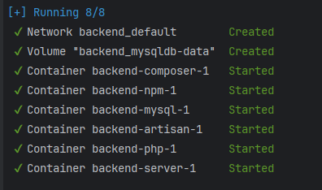
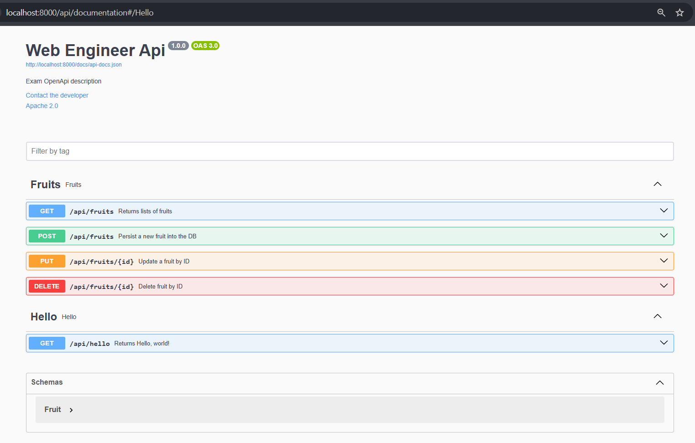

## Getting Started
- Navigate to project root and run:
```bash
    docker-compose up
```
You should see: \


- Then
- Open another terminal and run:
```bash
    docker-compose run --rm artisan migrate
```

Then Navigate to APi Docs at:
http://localhost:8000/api/documentation

You will see something like the below, can start by first adding 2 fruits and proceed. No Auth is required

